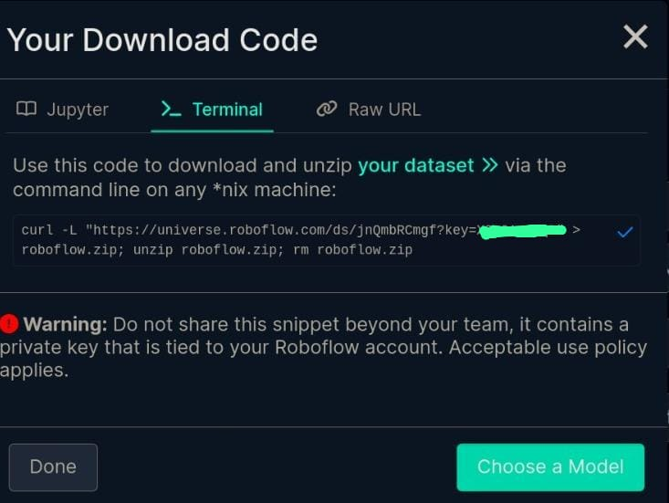
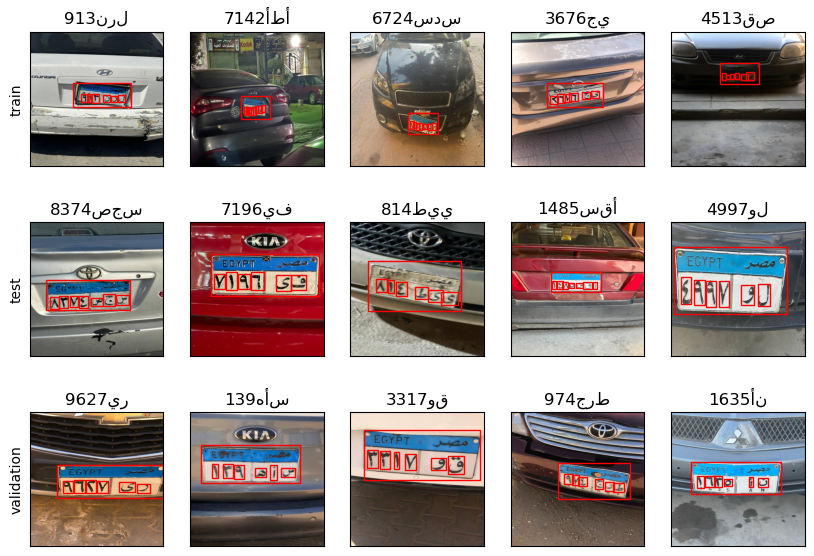
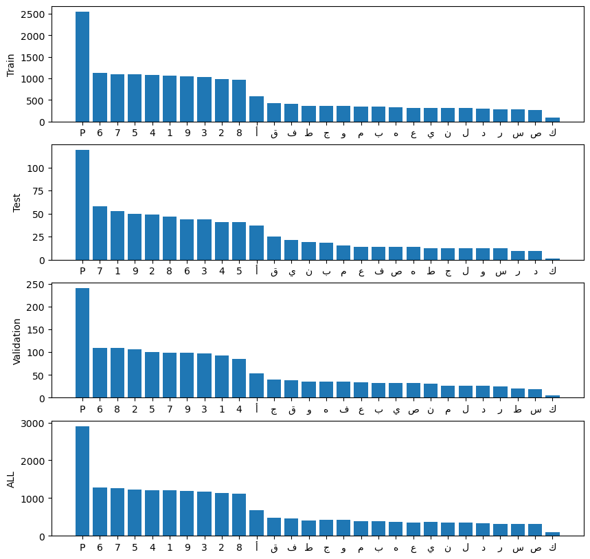

# Car plate recognition project.
This project aims to detect car plate and number in cars.
The dataset used can be found in roboflow: [here](https://universe.roboflow.com/fbi-senstive-information/egypt-car-plates).

The projects consists of:
- dataset download.
- model download. 
- data exploration and visualization.
- model training.

## Get started with the project

### Get your roboflow key
Open the dataset link. then click Dataset in the dashboard. Choose V4 of the data. then click download with YOLOv9 format.

you will see something like this:



copy the key and paste it `example.env` file. then rename it to `.env`


## dataset download
you can download the dataset py running this command:
```shell
./scripts/download_ds.sh
```

## Model download
you can download the pretrained models py running this command:
```shell
./scripts/download_model.sh <MODEL_NAME>
```
available model names:
- YOLOv9t
- YOLOv9s
- YOLOv9m
- YOLOv9c
- YOLOv9s

## data exploration and visualization
Explore the data by seeing examples from train, test, and validation splits by running this command:
```shell
python ./scripts/data_visualization.py
```
the resulting visualiztion will be in images folder under the name `data_examples.png`



Also view the count of each letter in the car plates dataset by running this command:
```shell
python ./scripts/data_explore.py
```
the resulting visualiztion will be in images folder under the name `labels_count.png`



## Train the model
After downloading the dataset and the model you can start training the model.

You can specify the model name in `training_args.yaml` file to match the model that you have downloaded. 

You can change any training argument or add training arguments in `training_args.yaml`.

Then to start training run this command:

```shell
python ./scriots/train.py
```
After training, the train logs and checkpoints will be in `train_results` directory. 

based on the number of times you have run the training script, you will have directories `train`, `train1`, `train2`, ... 

each directory contatins the logs, checkpoints and the best checkpoint during the training.

you can continue training from any checkpoint by specifying the `model` and `train_dir` in `training_args.yaml`.

then run this command:
```shell
python ./scripts/train --cont True
```


